## Introduction
CI/CD에 대한 기본적인 개념 정리하고, 로컬 단말기(홈 서버)에 구성한 샘플 CI/CD 환경 구현에 사용된 기술 및 전략에 대해 정리한 문서

### CI / CD 정의
애플리케이션의 개발 단계(코드 개발, 버전 관리, 빌드, 테스트, 배포)를 자동화하여 신속하게 애플리케이션의 기능을 고객에게 제공하기 위한 방법이다. 새로운 기능 개발을 위해 개발자들이 작성하는 코드를 짧은 주기로 통합이 가능하도록 지원하는데 이 과정에서 개발과 운영팀이 분리되어 있어서 발생하는 문제를 효과적으로 해결할 수 있게 해주는 개발 및 배포 방법이다. 

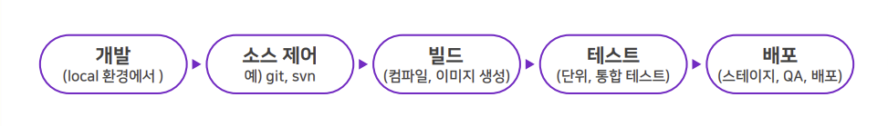

### Continuous Integration
빌드와 통합 단계에 적용되는 개념으로 개발자의 코드를 중앙에서 정기적으로 통합하고, 업데이트 된 내용을 검증해 릴리스에 소요되는 시간을 줄일 수 있게 해준다. 개발자 별로 작성한 코드의 업데이트 내용을 짧게 자주 통합할 수 있는 환경을 제공해서 병합 과정에 발생하는 코드의 충돌이나 버그를 최소화할 수 는 환경을 제공한다. CI 빌드 단계에서 아티팩트로 컨테이너 이미지가 만들어지는데, 이 때 가장 중요한 점은 빌드를 반복가능하고 일관된 방식으로 사용 가능하도록 구성하는 것이다. 결과적으로 CI를 통해 개발 생산성이 높아지고, 새로 변경되는 애플리케이션의 문제점을 조기에 찾아낼 수 있다. 

### Continuous Delivery & Deployment
코드 변경 사항이 반영된 애플리케이션이 언제든지 릴리스 될 수 있도록 준비 혹은 배포하는 단계다. 배포 아티팩트를 이용해서 배포 환경(운영, 개발, 스테이징 등)에 애플리케이션을 배포한다. 배포 단계에서 사용되는 아티팩트는 CI 단계에서 만들어진 컨테이너 이미지와 쿠버네티스 매니페스트와 같은 파일이 해당 된다. Delivery와 Deployment의 가장 큰 차이는 배포하는 단계에서 수동으로 승인하는 절차의 유무다. Deployment 방식은 전 과정을 자동으로 구성해서 배포까지 승인 없이 이루어지는데, Delivery는 수동으로 승인 후에 배포가 진행되는 방식이다. Deployment 방식을 구현하기 위해서는 엄격한 테스트 시나리오와 적절한 배포 방식을 선정해서 구성해야한다.

<p align="center">
  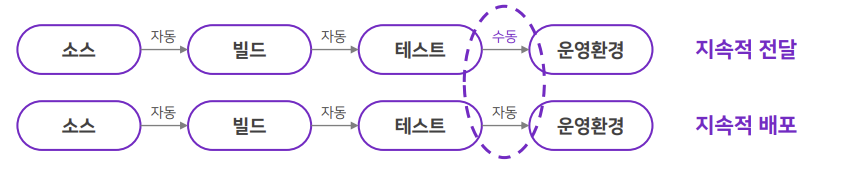
</p>


## CI/CD 구성 현황

### CI/CD 단계별 도구 종류
|    단계     |        분류         |                            도구                             |  선정   |
| :---------: | :-----------------: | :---------------------------------------------------------: | :-----: |
|    개발     |         IDE         |                   VS Code, IntelliJ IDEA                    | VS Code |
|  소스제어   |    형상관리도구     |              git, svn (subversion), mercurial               |   git   |
|             |   중앙레포지토리    |      github, bono git server, gitea, gitlab, bitbucket      | github  |
|    빌드     |      빌드 도구      |                npm, maven, gradle, ant, make                |   npm   |
|             |       CI 도구       | jenkins, github actions, gitlab CI/CD, circle CI, travis CI | jenkins |
|   테스트    |     단위 테스트     |                JUnit, Jest, Mocha, Selenium                 |    -    |
|             |    보안스캔 도구    |           Trivy, Clair, Anchore, Snyk, SonarQube            |    -    |
| 이미지 관리 | 컨테이너 레지스트리 |                  Docker Hub, Harbor, Nexus                  |  Nexus  |
|    배포     |      배포도구       |                       ArgoCD, Flux CD                       | ArgoCD  |

### CI/CD 단계별 전략 및 구성 요소
|   단계   |      분류      |                     선택 가능한 전략 / 구성                     |        선정        |
| :------: | :------------: | :-------------------------------------------------------------: | :----------------: |
| 소스제어 |  브랜치 전략   |         Git Flow, GitHub Flow, GitLab Flow, Trunk-based         |      Git Flow      |
|          |   병합 전략    |        Merge commit, Squash and merge, Rebase and merge         |  Squash and merge  |
|          |   태깅 전략    |               Semantic, Date-based, Build number                |      Semantic      |
|   빌드   |  트리거 방식   |            Poll SCM, Webhook, 수동 트리거, 스케줄링             |      Poll SCM      |
|          |  병렬화 전략   |           단일 작업, 파이프라인 병렬화, 매트릭스 빌드           |     단일 작업      |
|          |  이미지 빌드   |                        Multi-stage 빌드                         |  Multi-stage 빌드  |
|  테스트  |   단위테스트   |          전체 테스트, 변경 기반 테스트, 계층별 테스트           |         -          |
|          |  이미지 스캔   |  빌드 중 스캔, 레지스트리 스캔, 빌드 후 CI 파이프라인 내 스캔   |         -          |
|   배포   |  트리거 방식   | Push Pattern, Pull Pattern 1(CI), Pull Pattern 2(Image Updater) | Pull Pattern 1(CI) |
|          |   배포 전략    |           Blue/Green, Canary, Rolling update, Canary            |         -          |
|          |   롤백 전략    |                자동 롤백, 수동 롤백, 점진적 롤백                |         -          |
|          | 배포 환경 구성 |                      운영, 개발, 스테이징                       |         -          |


### 주요 선정 전략/구성요소에 대한 개요

#### ① Git Flow
main, develop, feature, release, hotfix 5개의 브랜치를 사용하는 것을 권장하는 방식이다. 5개의 브랜치 중 main, develop 브랜치는 필수로 사용하고 나머지 3개의 브랜치는 필요에 따라 생성해서 사용한다. 특정 목적을 달성하고 난 다음에는 선택적으로 생성한 브랜치를 제거할 수도 있다. 가장 많이 사용되는 전략이지만, 전략을 잘못 사용하게 되면 브랜치가 많아지면서 코드 품질이 저하될 수 있다. 대규모 프로젝트나 정기적인 릴리즈가 있는 프로젝트에 적합하다.

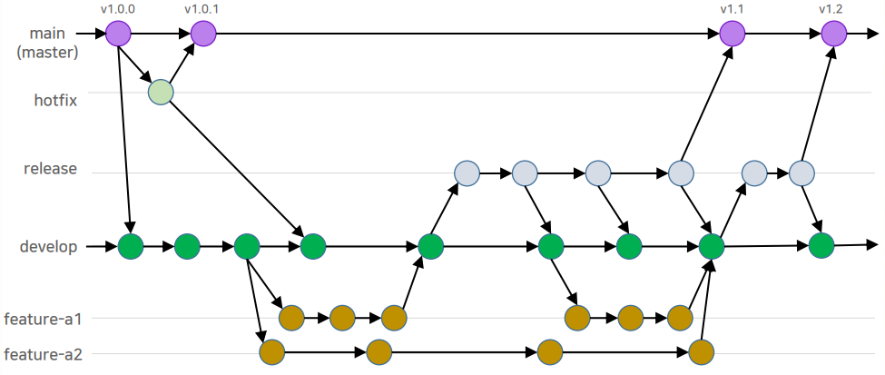

| Branch  | Required | Description                                                                                 |
| :-----: | :------: | :------------------------------------------------------------------------------------------ |
|  main   |    ○     | • 이 브랜치에 변경 사항이 발생하는 경우 운영 환경으로 배포하는데 활용 (=서비스 버전 업)     |
| develop |    ○     | • 기능 개발 된 후 단위 테스트까지 마무리된 깔끔한 코드를 저장하는 브랜치                    |
|         |          | • 이 브랜치에 변경 사항이 발생하는 경우 개발 환경으로 배포하는데 활용                       |  |
| release |    ×     | • develop 브랜치의 코드를 main 브랜치로 병합하기 전에 테스트 환경에 배포 테스트를 위해 사용 |
|         |          | • 이 브랜치에서 배포 테스트가 완료된 후 이상이 없을 경우 main 브랜치로 병합                 |
| feature |    ×     | • 신규 기능을 개발하기 위해 사용하는 브랜치                                                 |
|         |          | • 기능 개발이 완료되고 나면 단위 테스트까지 마무리 한 다음 develop 브랜치로 병합            |
| hotfix  |    ×     | • 서비스 운영 중 중대한 버그가 발생해 바로 수정이 필요한 경우 활용하는 브랜치               |
|         |          | • 버그가 개선된 코드는 main, develop 브랜치로 병합                                          |

#### ② Squash and merge
자식 브랜치에서 여러 가지 작업이 진행되면서 다수의 커밋이 만들어질 수 있는데, 이 때 부모 브랜치로 병합하는 과정에는 하나의 커밋으로 합쳐서 병합하는 방식이다. 부모 역할을 담당하는 메인 브랜치는 여러 커밋을 하나로 압축하여 관리하기 때문에 깔끔하게 이력을 유지할 수 있고 롤백이 용이해지지만, 세부적인 작업 내역을 메인 브랜치에서 파악하기 어렵다는 단점이 있다.

<p align="center">
  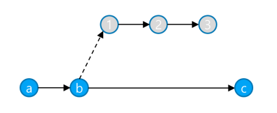
</p>

#### ③ Semver(Semantic Versioning)
MAJOR.MINOR.PATCH(예: 1.4.2) 체계를 따르는 버전 관리 방식이다. 

<p align="center">
  
</p>

- MAJOR 버전이 0으로 표시되는 경우 아직 개발단계에 있는 불안정한(unstable) 단계라는 의미다.
- MINOR 버전은 해당 버전 내에서 API 명세가 많이 바뀌지 않았고, 바뀌었더라도(API 기능 추가, 또는 삭제) 이전 버전에 대한 호환성을 보장한다.
- PATCH는 긴급한 버그 수정이나 사소한 업데이트가 발생한 경우 올라간다.

Semver가 가지는 문제점이 있는데, 개발자들 마다 버전업의 경계가 다르다는 것이다. 개발 조직 별로 주장하는 표준이 다르다. 그래서, LINE과 같은 경우 이러한 문제를 방지하고자 자체적으로 [HeadVer](https://github.com/line/headver)를 만들어서 관리하고 있다. 그리고, Semver의 버저닝 작업을 개발자가 수동으로 관리하는 경우도 있는데, 이를 [자동화](https://github.com/cycjimmy/semantic-release-action)하는 역할을 DevOps 담당자가 진행한다.

> [!TIP]
> ***ArgoCD와 latest 태그의 업데이트 감지***
> - ArgoCD는 기본적으로 이미지 태그가 변경되지 않으면 업데이트가 필요하다고 인식하지 않는다. 
> - lastest 태그의 컨테이너 이미지에 변경이 발생했어도 태그 이름 자체는 동일하기 때문에 ArgoCD는 변경을 감지하지 못한다.
> - `imagePullPolicy: Always` 를 설정해도 매니페스트 파일 자체에 변경이 발생 했을 때 업데이트가 진행된다.
> - 이미지의 내용만 변경 되고 매니페스트에는 변화가 없다면, 자동으로 감지되지 않는다.

> [!NOTE]
> ***실무에서는 특정 버전 태그 사용 권장***
> - 명확한 버전 추적과 감사 가능: 문제 발생 시 어떤 버전에서 문제가 되는지 명확하게 확인 가능
> - 안정적인 롤백: latest를 사용할 경우 과거 버전의 이미지가 어떤 것이었는지 알기 어려움
> - 배포 환경 일관성 지원: 특전 버전 태그를 사용할 경우 동일한 버전 배포가 보장되기 때문에 예상치 못한 차이를 방지
> - 의도하지 않은 배포 방지: latest 태그를 사용하면 운영 환경에 준비되지 않은 변경사항이 자동으로 배포될 수 있음

#### ④ Multi-stage 빌드
빌드 단계와 실행 단계를 분리하여 최종 이미지 크기 최소화하는 방식이다.

```Dockerfile
# IMAGE BUILD
FROM node:22 AS BUILD_IMAGE
WORKDIR /app
COPY . .
RUN npm install

# APP RUNNING
FROM node:22-alpine
WORKDIR /app

COPY --from=BUILD_IMAGE /app/app.js ./app.js
COPY --from=BUILD_IMAGE /app/views ./views
COPY --from=BUILD_IMAGE /app/node_modules ./node_modules

ENTRYPOINT ["node", "app.js"]
```

#### ⑤ Pull Pattern 1(CI)
CI 과정에서 소스 코드 통합, 빌드, 테스트 등의 과정을 마친 후 자동으로 CD 단계로 이어질 수 있게 트리거 역할을 직접 수행하는 방식이다. CI 도구에서 빌드 아티팩트(컨테이너 이미지)를 만들어 Configuration Repository에 기록된 파드 이미지의 버전을 직접 수정한다. Operator(ArgoCD 등)는 Configuration Repository의 변경사항을 탐지하고, CI 도구를 통해 변경되거나 인프라 매니저를 통해 변경된 내용이 탐지되면 배포 환경과 동기화를 진행한다.

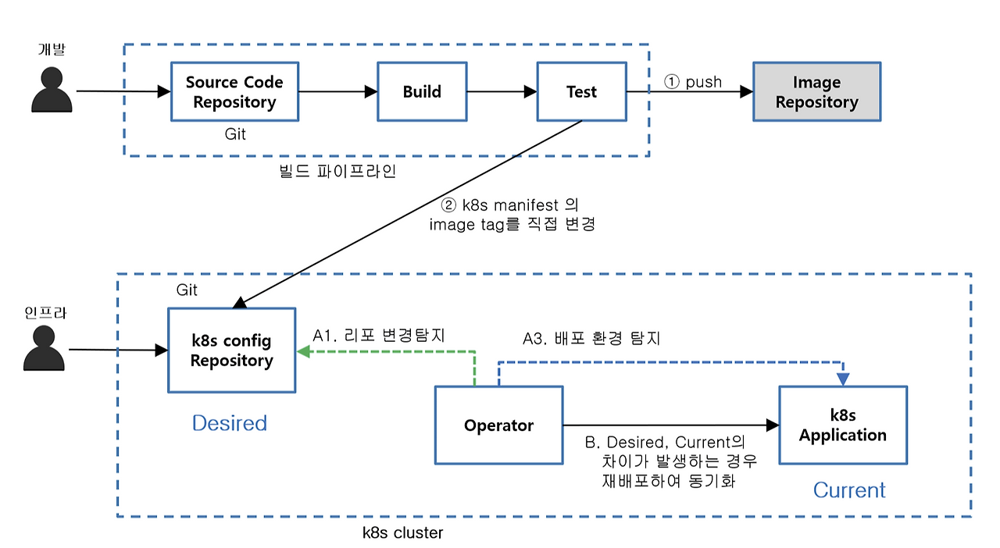


## Architecture

### System Diagram
전체 시스템은 온프레미스 환경을 가정하고 로컬 단말기(홈 서버)에서 Virtual Box를 이용해 Virtual Machine 기반으로 구성되어 있다. Linux Server로 구성된 3대의 VM에 Kubespray를 이용해 Master 노드 1대, Worker 노드 2대로 구성해 Kubernetes Cluster 환경으로 구축되어 있다. 외부 연동을 위해 Nginx Controller, Metal LB를 구성하였고, IPtime의 포트 포워딩을 통해 로컬 네트워크 외부에서 접근할 수 있도록 구성되어 있다. 

<p align="center">
  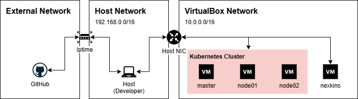
</p>

|  ID   |  Name   |        OS        |  CPU  | Memory |   VM IP   | Notes                                             |
| :---: | :-----: | :--------------: | :---: | :----: | :-------: | :------------------------------------------------ |
|   1   | master  | Ubuntu 24.04 LTS |   1   |   2    | 10.0.0.10 | Control Plane, Work Space(vscode)                 |
|   2   | node01  | Ubuntu 24.04 LTS |   1   |   2    | 10.0.0.11 | Worker Node                                       |
|   3   | node02  | Ubuntu 24.04 LTS |   1   |   2    | 10.0.0.12 | Worker Node                                       |
|   4   | nexkins | Ubuntu 24.04 LTS |   1   |   2    | 10.0.0.20 | Container Image Registry(Nexus), CI Tool(Jenkins) |

### Service Port Information
|  ID   |  Name   |  Host IP  | Host Port |   VM IP    | VM Port | Protocol |    Notes    |
| :---: | :-----: | :-------: | :-------: | :--------: | :-----: | :------: | :---------: |
|   1   | master  | 127.0.0.1 |   8022    | 10.0.0.10  |   22    |   ssh    |             |
|   2   | node01  | 127.0.0.1 |   8023    | 10.0.0.11  |   22    |   ssh    |             |
|   3   | node02  | 127.0.0.1 |   8024    | 10.0.0.12  |   22    |   ssh    |             |
|   4   | nexkins | 127.0.0.1 |   8030    | 10.0.0.20  |   22    |   ssh    |             |
|   5   |  nexus  | 127.0.0.1 |   8081    | 10.0.0.20  |  8081   |   http   |   web_ui    |
|   6   |  nexus  | 127.0.0.1 |   8082    | 10.0.0.20  |  8082   |   http   |  registry   |
|   7   | jenkins | 127.0.0.1 |   8080    | 10.0.0.20  |  8080   |   http   |   web_ui    |
|   8   | ingress | 127.0.0.1 |    80     | 10.0.0.100 |   80    |   http   | web_service |
|   9   | ingress | 127.0.0.1 |    443    | 10.0.0.100 |   443   |  https   | web_service |
|  11   | argocd  | 127.0.0.1 |   8443    | 10.0.0.101 |   443   |  https   |   web_ui    |

### Workflow
소스 코드의 기능이 개발된 이후 GitHub에 코드를 푸시한 다음 이루어지는 CI/CD 작업 흐름이다. 버저닝 방식 테스트를 위해 구성한 환경으로 Configuration Repository와 배포 환경이 하나로 구성되어 있지만, 실제 환경 적용 시 브랜치와 쿠버네티스 클러스터를 추가 후 ArgoCD에서 Application을 환경별로 구성하면 된다.

<p align="center">
  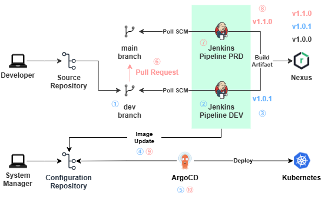
</p>

#### dev branch workflow
① 개발 소스 코드 GitHub `dev` 브랜치로 push  
② Jenkins에서 Poll SCM 방식으로 변경 사항을 감지 후 파이프라인 트리거   
③ 빌드 후 아티팩트로 `PATCH` 버전을 업데이트 한 다음 Nexus 레지스트리에 이미지 저장  
④ Configuration Repository에 있는 values.yaml 파일에서 tag 값을 수정 후 push  
⑤ 변경사항을 감지한 ArgoCD에서 업데이트 된 컨테이너 이미지의 버전으로 배포 환경과 동기화 진행  

#### main branch workflow
⑥ dev branch에서 `main` 브랜치 방향으로 `Pull Request` 생성  
⑦ Jenkins에서 Poll SCM 방식으로 변경 사항을 감지 후 파이프라인 트리거  
⑧ 빌드 후 아티팩트로 `MINOR` 버전을 업데이트 한 다음 Nexus 레지스트리에 이미지 저장  
⑨ Configuration Repository에 있는 values.yaml 파일에서 tag 값을 수정 후 push  
⑩ 변경사항을 감지한 ArgoCD에서 업데이트 된 컨테이너 이미지의 버전으로 배포 환경과 동기화 진행  

### Container Diagram

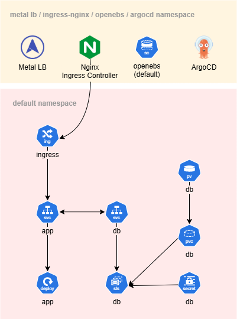


## CI 구현 상세 내역

### Jenkinsfile Pipeline에서 Git Parameter Plug-in을 이용해 브랜치를 동적으로 처리

#### ① Git Parameter Plug-in 설치 후 Parameter 설정

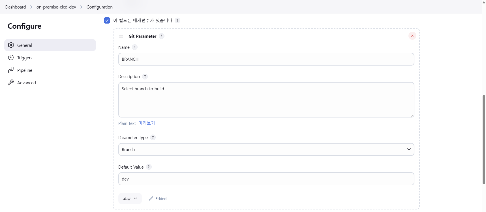

#### ② Jenkinsfile Pipeline 설정

```groovy
stage("Checkout") {
    steps {
        checkout(
            [$class: 'GitSCM', 
            branches: [[name: "${params.BRANCH}"]],
            userRemoteConfigs: [[
                url: 'https://github.com/seunghyun-you/on-premise-cicd',
                credentialsId: 'github-accesskey'
            ]]
            ]
        )
    }
}
```

### Source Code Repository의 폴더 마다 동적으로 빌드 작업을 진행하도록 처리

#### ① Source Code Repository 폴더 구조

```bash
$ tree .
.
├── Jenkinsfile
├── app
│   ├── Dockerfile
│   ├── app.js
│   ├── package-lock.json
│   ├── package.json
│   └── views
└── db
    ├── Dockerfile
    ├── pg_hba.conf
    └── postgresql.conf
```

#### ② Jenkinsfile Pipeline에서 `when {changset ... }` 이용 변경된 폴더 이름을 배열에 저장

```groovy
stage('Create Variable') {
    steps {
        script {
            services = []
            builds = []
        }
    }
}
stage('App Directory Check') {
    when { changeset "app/**" }
    steps {
        script {
            services.add([NAME: 'app'])
        }
    }
}
stage('DB Directory Check') {
    when { changeset "db/**" }
    steps {
        script {
            services.add([NAME: 'db'])
        }
    }
}
```

#### ③ 변경이 감지된 폴더를 지정해서 빌드 작업 진행 → 빌드 아티팩트는 builds 배열에 저장

```groovy
stage('Docker Build') {
    agent any
    steps {
        script {
            services.each { service ->
                ...
                dir("./${service.NAME}") {
                    echo "${env.NEXUS_URL}/${service.NAME}:${NEW_IMAGE_VERSION}"
                    def artifact = docker.build("${env.NEXUS_URL}/${service.NAME}:${NEW_IMAGE_VERSION}")

                    builds.add([NAME: "${service.NAME}", 
                                VERSION: "${NEW_IMAGE_VERSION}",
                                ARTIFACT: artifact])

                    echo "Success ${service.NAME} images build: ${NEW_IMAGE_VERSION}"
                }
            }
        }
    }
}
```

#### ④ 컨테이너 이미지 레지스트리에 빌드 아티팩트 저장

```groovy
stage('Push Image') {
    agent any
    steps {
        script {
            builds.each { build ->  
                docker.withRegistry("https://${env.NEXUS_URL}", "nexus-credential") {     
                    build.ARTIFACT.push("${build.VERSION}")
                    build.ARTIFACT.push("latest")
                }
            }
        }
    }
}
```

### Branch에 따라 동적으로 이미지 버저닝 처리

#### ① 변경이 감지된 폴더에 맵핑된 컨테이너 이미지 레지스트리의 최신 버전 확인

```groovy
withCredentials([usernamePassword(
    credentialsId: 'nexus-credential', 
    usernameVariable: 'NEXUS_USER', 
    passwordVariable: 'NEXUS_PASS')]) {

    def CURL_RESULT = sh(
        script: "curl -s -u ${NEXUS_USER}:${NEXUS_PASS} ${NEXUS_URL}/v2/${service.NAME}/tags/list",
        returnStdout: true
    )
    echo "${CURL_RESULT}"

    def IMAGE_VERSION = sh(
        script: "echo '${CURL_RESULT}' | jq -r .tags[] | sort -Vr | head -n 1",
        returnStdout: true
    ).trim()
    echo "${IMAGE_VERSION}"
```

#### ② dev, main 브랜치에 따라 다르게 이미지 버전 지정

```groovy
    def CLEAN = IMAGE_VERSION.replace("v", "")
    def parts = CLEAN.tokenize('.')
    def MAJOR = parts[0] as int
    def MINOR = parts[1] as int
    def PATCH = parts[2] as int

    if (params.BRANCH.contains('dev')) {
        def NEW_PATCH = PATCH + 1
        NEW_IMAGE_VERSION = "v${MAJOR}.${MINOR}.${NEW_PATCH}"
        echo "${NEW_IMAGE_VERSION}"
    } else if (params.BRANCH.contains('main')) {
        def NEW_MINOR = MINOR + 1
        NEW_IMAGE_VERSION = "v${MAJOR}.${NEW_MINOR}.0"
        echo "${NEW_IMAGE_VERSION}"
    }
}
```

### CI 단계에서 Configuration Repository의 매니페스트 파일 이미지 업데이트 처리

```groovy
stage('Image Update') {
    agent any
    steps {
        script {
            builds.each { build ->
                withCredentials([gitUsernamePassword(credentialsId: 'github-accesskey')]) {
                    sh "rm -rf *"
                    sh "rm -rf .git"
                    sh "git clone https://github.com/seunghyun-you/on-premise-cicd-manifest.git"
                    sh "git config --global user.email 'jenkins@example.com'"
                    sh "git config --global user.name 'Jenkins CI'"

                    dir ('on-premise-cicd-manifest') {
                        sh "sed -i 's/tag: \"v[0-9]\\+\\.[0-9]\\+\\.[0-9]\\+\"/tag: \"${build.VERSION}\"/g' ${build.NAME}/values.yaml"
                        
                        sh "git add ."
                        sh "git commit -m 'Update image tag to ${build.VERSION}'"
                        sh "git push origin main"
                    }
                }
            }
        }
    }
}
```

## 실제 동작 과정 

### dev 브랜치 배포

#### ① Nexus에 저장된 현재 최신 이미지 버전 확인

```bash
$ curl -s 10.0.0.20:8082/v2/app/tags/list | jq -r .tags[] | sort -Vr | head -n 1                 
v1.1.0
```

#### ② ArgoCD 배포 버전 확인

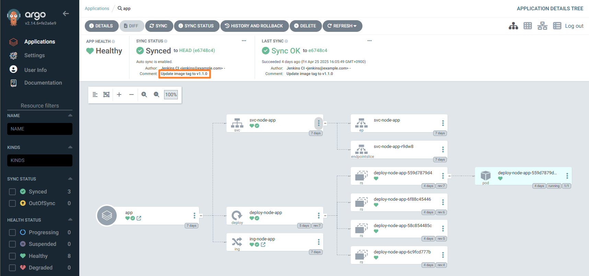

#### ③ Branch 전환

```bash
$ git branch
* dev
  main
```

#### ④ 소스 코드 변경 확인

```bash
$ git status
On branch dev
Changes not staged for commit:
  (use "git add <file>..." to update what will be committed)
  (use "git restore <file>..." to discard changes in working directory)
        modified:   app/app.js
        modified:   app/views/index.ejs
```

#### ⑤ 소스 코드 Push

```bash
$ git add . && git commit -m "update app code" && git push origin dev
```

#### ⑥ Jenkins 상태 확인

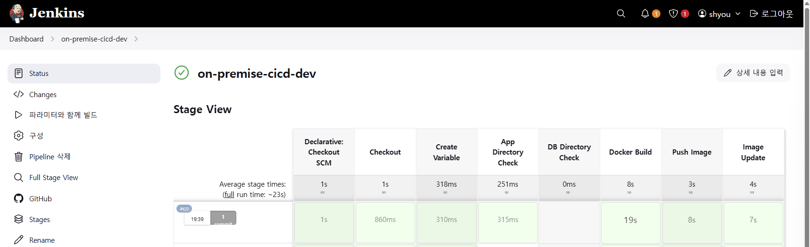

#### ⑦ ArgoCD 배포 버전 확인

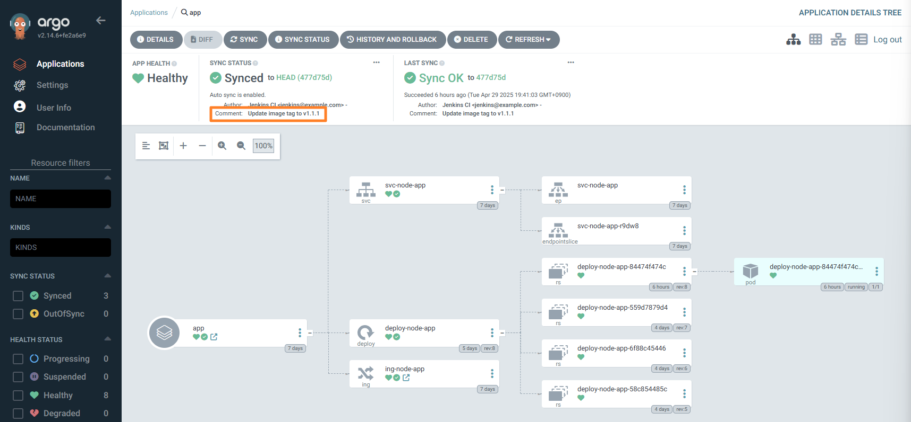

### main 브랜치 배포

#### ① GitHub PR 생성

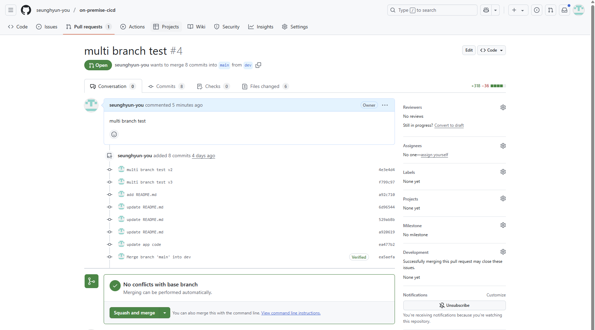

#### ② Jenkins 상태 확인

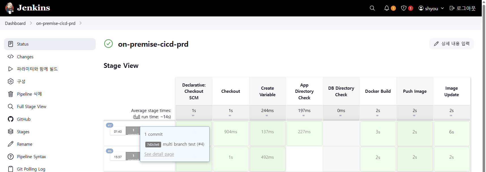

#### ③ ArgoCD 배포 버전 확인

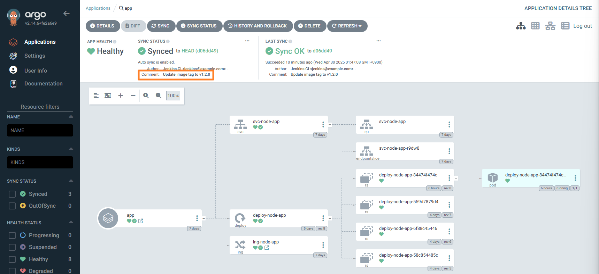

## ACTION ITEM
- [ ] 컨테이너 이미지 보안 스캐너 
- [ ] 백업 시스템 테스트
- [ ] 모니터링 시스템 (그라파나, 프로메테우스)
- [ ] 로그 중앙 수집 시스템 (ELK Stack)
- [ ] Resource Naming Rule(Convention) 수립
- [ ] 버전 관리 및 브랜치 관리 세부 전략 수립
